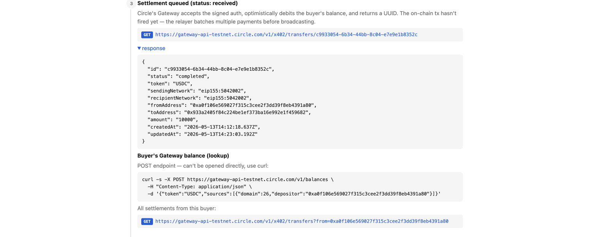
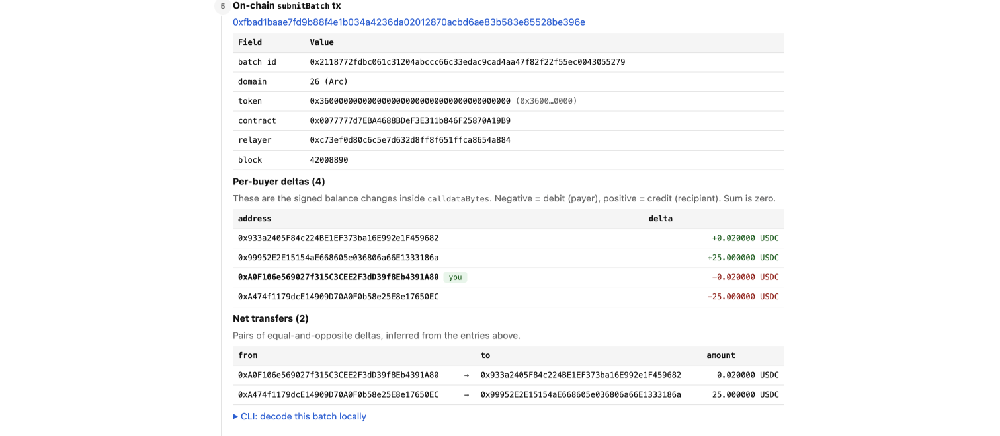

# circle-agent

An **explainer companion** to Circle's <a href="https://github.com/circlefin/arc-nanopayments">arc-nanopayments</a>. Where the upstream demo shows what a production-shaped x402 app looks like (full Next.js seller dashboard, Supabase persistence, LangChain buyer agent), this repo zooms in on the single question *"what actually happens when an x402 payment settles?"*.

It does that by pairing a deliberately small paywalled server (`server.ts`) with two pieces you won't find in the upstream demo:

- **`decode-batch.ts`** — pulls a Gateway `submitBatch(...)` transaction off Arc Testnet and decodes its calldata into per-buyer balance deltas, net transfers, and (via a heuristic against Circle's facilitator API) the off-chain settlement UUIDs that landed in the batch.
- **`public/buyer.html`** — a step-by-step **payment trace UI**: buyer signs EIP-712 → facilitator settles → settlement queued → relayer batches → on-chain `submitBatch` tx → settlement marked completed. Every step links to the underlying API call or explorer page so you can follow the lifecycle by hand.

The `/hello-world` paywall is just enough surface area to generate a real settlement you can trace through both tools.

## Prerequisites

- Node.js 20+
- An Arc Testnet wallet funded with testnet USDC (MetaMask for the browser buyer, or a raw private key for the CLI buyer). Get testnet USDC from the [Circle faucet](https://faucet.circle.com/).

## Installation

```bash
npm install
```

## Running the server

```bash
npm start
```

This runs `tsx server.ts` and listens on `http://localhost:3000`.

Endpoints:
- `GET /hello-world` — paywalled at `$0.01` USDC via the Gateway middleware
- `GET /api/settlement/:id` — proxies the Gateway settlement lookup
- `GET /api/decode-batch/:hash` — decodes a `submitBatch` transaction
- `GET /api/batch-tx/:id` — resolves a settlement id to its on-chain batch tx
- `/` — redirects to `/buyer.html` (browser-based buyer UI)

## Running the buyer (browser — recommended)

With the server running, open `http://localhost:3000/` in a browser. The page (`public/buyer.html`) connects to MetaMask, prompts you to switch to Arc Testnet, and signs the EIP-712 payment authorization in the wallet. No env vars or private keys required.

After paying, the page renders a six-step **payment trace** for the settlement you just created, with every step linked to the corresponding facilitator API call or block-explorer page. You can also paste any existing settlement UUID into the "Payment trace" input to inspect a past payment — the page ships with one pre-loaded so the trace is browseable without paying first.

## Payment lifecycle walkthrough

What `public/buyer.html` actually shows after a `/hello-world` payment, step by step. Open the page locally to interact with the live links; the screenshots below are what you'd see for the pre-loaded demo settlement `c9933054-6b34-44bb-8c04-e7e9e1b8352c`.

### 1. Buyer signs an EIP-712 payment authorization (off-chain)

The buyer's wallet signs a `TransferWithAuthorization` typed-data message scoped to the `GatewayWallet` contract. No transaction, no gas — just a signature that authorizes a debit up to `value` before `validBefore`.


### 2. Merchant's middleware settles via the Circle facilitator

The server's `createGatewayMiddleware` (see `server.ts`) forwards the signed authorization to Circle's facilitator with `POST /v1/x402/settle`. The facilitator returns a **settlement UUID** — not yet a tx hash.


### 3. Settlement queued (`status: received`)

Circle's Gateway accepts the signed auth, optimistically debits the buyer's balance, and returns the UUID. The on-chain tx hasn't fired yet — the relayer batches multiple payments before broadcasting. Inspect the settlement via `GET /v1/x402/transfers/:id` (also exposed locally at `/api/settlement/:id`).



### 4. Relayer batches multiple transfers

Circle's relayer (an EOA controlled by Circle — `0xc73e…a884` for the pinned demo settlement, but Circle may rotate it) waits for a flush trigger (volume or timer) and then calls `submitBatch(calldataBytes, signature)` on the `GatewayWallet` contract. One on-chain tx settles many buyers' payments at once. On Arc Testnet, traffic is low and you should usually expect a ~10 minute wait before your settlement makes it on-chain — under heavy traffic the relayer flushes much faster (every few seconds), but you won't see that on testnet today.


### 5. On-chain `submitBatch` tx

This is the step `decode-batch.ts` exists to unpack. The page resolves the batch tx via `/api/batch-tx/:id`, then `/api/decode-batch/:hash` pulls apart `calldataBytes` to show the `batchId`, the per-buyer signed deltas (negative = debit, positive = credit, sum = zero), and the net transfers inferred by pairing equal-and-opposite deltas. The buyer's own row is highlighted with a `you` badge.



### 6. Settlement marked completed

After the batch tx is mined, Circle updates the settlement record. `updatedAt` on completed settlements aligns with the batch tx's block timestamp (±2s), which is the heuristic `decode-batch.ts` uses to attach settlement UUIDs back to the buyer entries above.


## Running the buyer (CLI — optional)

Only use this if you want to pay from a raw private key instead of MetaMask. In a separate terminal, with the server running:

```bash
export PRIVATE_KEY=0x...   # Arc Testnet wallet private key
npm run buyer              # pays http://localhost:3000/hello-world
```

To pay a different URL:

```bash
npx tsx buyer.ts http://localhost:3000/hello-world
```

## Decoding a batch transaction (CLI)

`decode-batch.ts` is the centerpiece of this repo. It takes a Gateway `submitBatch(...)` transaction hash and pulls apart the on-chain calldata to show:

- the `batchId` and `relayer` that submitted the batch,
- the `(address, int256 delta)` pairs encoded inside `calldataBytes` — i.e. every buyer/recipient whose balance shifted in that batch,
- the **net transfers** inferred by pairing each negative delta with an equal-and-opposite positive,
- and the **off-chain settlement UUIDs** for each buyer, looked up against Circle's facilitator API and matched by block-timestamp window. Settlement UUIDs aren't stored on-chain, so this is a heuristic — useful for tracing demo payments, but expect aggregate deltas (one entry can be the sum of several settlements that landed in the same batch window).

`decode-batch.ts` is also imported by the server's `/api/decode-batch/:hash` endpoint, which is what the browser trace UI calls.

```bash
npx tsx decode-batch.ts 0xfbad1baae7fd9b88f4e1b034a4236da02012870acbd6ae83b583e85528be396e
```

That hash is the batch tx for the demo settlement pinned in `public/buyer.html`. Replace it with any `submitBatch(...)` tx hash on Arc Testnet.

Override the RPC endpoint with `ARC_TESTNET_RPC` (default: `https://rpc.testnet.arc.network`):

```bash
ARC_TESTNET_RPC=https://your.rpc.url npx tsx decode-batch.ts 0x<batch-tx-hash>
```

You can find more batch tx hashes by clicking through from the buyer page's "Payment trace" section, or by querying `/api/batch-tx/:settlement-id`.

## Configuration

The seller address, facilitator URL, and Arc Testnet network id are hardcoded near the top of `server.ts`. Edit those constants to point at a different seller wallet or network.
